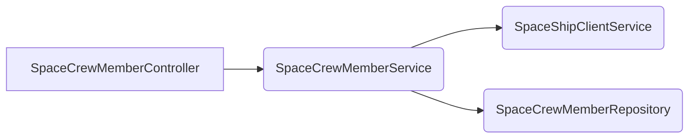

# spacecrew-manager
[](https://github.com/cf-training-springboot-2019/y/blob/master/LICENSE)

A small Spring microservice aimed towards both governance, management and operational tasks applied towards for the various crew member resources within the Spaceover platform.
The application uses Spring Boot parent bom version 2.4.5 as its foundation.

## Terminology
| Name | Description |
|:----------:|:-------------|
| SpaceCrewMember | A service managed model entity that retains various information associated with a space crew member. |


## Operations
| Name | Description |
|:----------:|:-------------|
| getSpaceCrewMembers | Synchronous operation that allows the retrieval of multiples persisted space crew member resource entries. |
| getSpaceCrewMember |  Synchronous operation that allows the retrieval of a single persisted space crew member resource entry. |
| createSpaceCrewMember |  Synchronous operation that allows the persistence of a single space crew member resource entry. |
| patchSpaceCrewMember| Synchronous operation that allows the partial update of a single space crew member persisted resource entry. |
| putSpaceCrewMember| Synchronous operation that allows the full update of a single space crew member persisted resource entry. |
| deleteSpaceCrewMember | Synchronous operation that allows the removal of a single space crew member persisted resource entry. |

## Getting Started

To quickly run the application simply execute spring-boot mvn plugin's **run** goal. This action most be performed from the project's root directory by using the following command in a terminal of your choosing.
```
mvn spring-boot:run
```

An alternative method would be through the creation of an OCI image by executing the plugin's build-image goal.
This image can then be used to run a standalone docker container by using the following command sequence
```
mvn spring-boot:build-image
docker run -d --name [container-name] -p 8080:8080 ${docker.registry}/${project.artifactId}:v${project.version}
```

## Structure
Here are the services beans and relationship:


